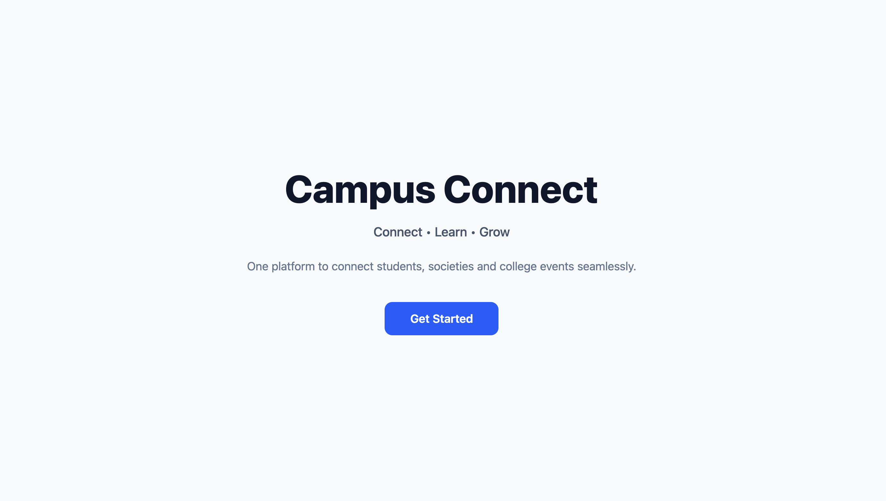
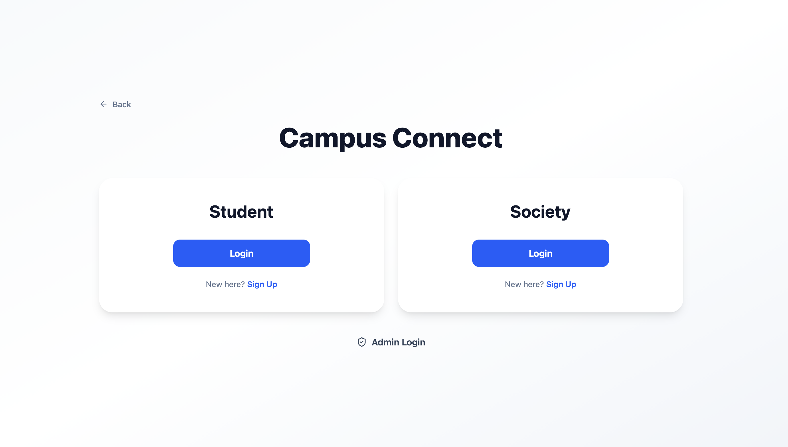
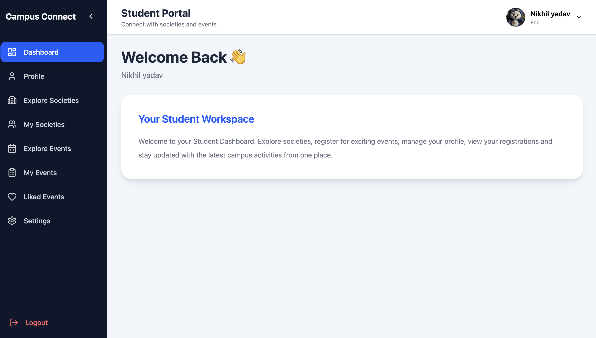
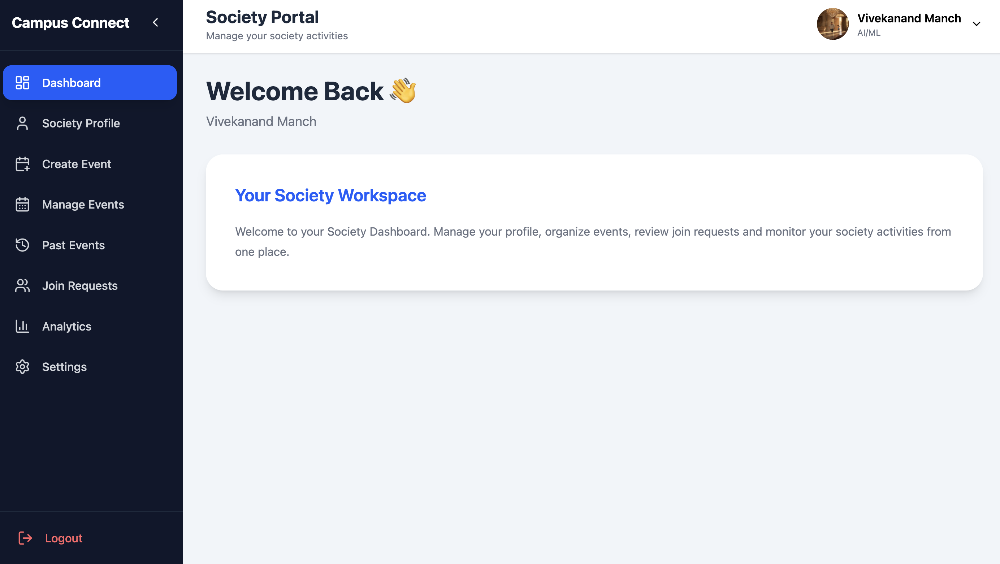
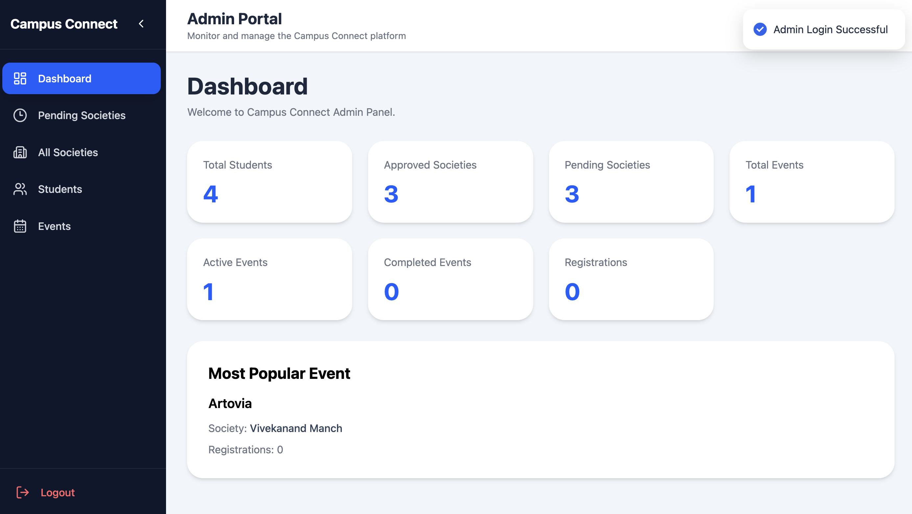
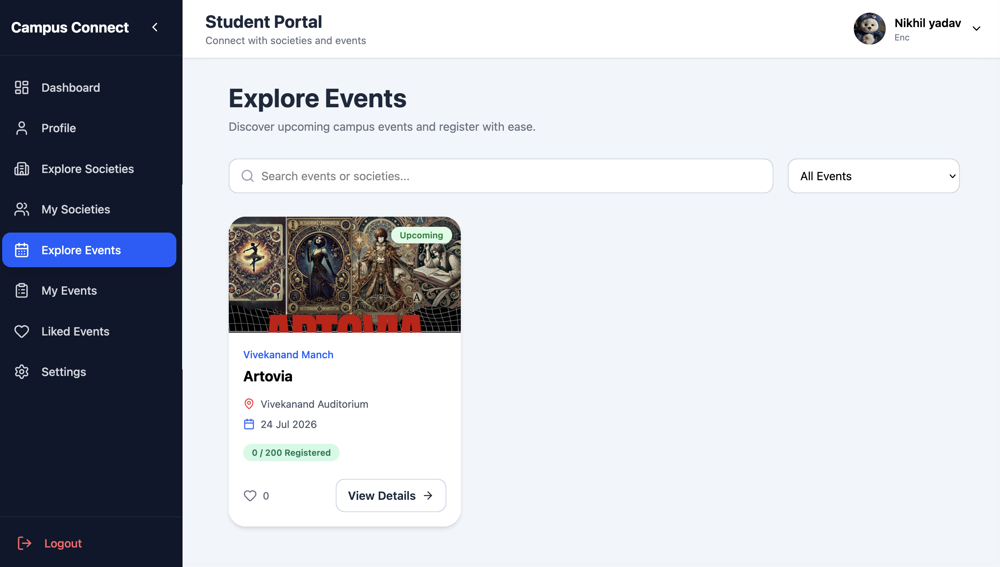
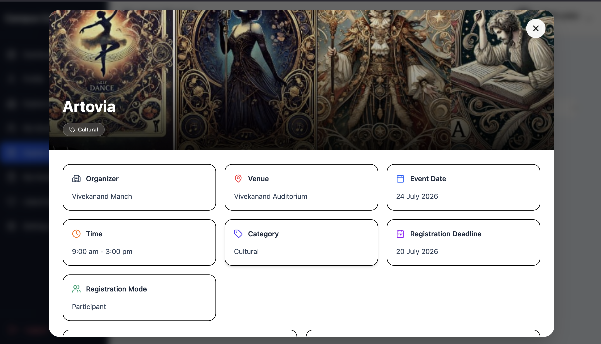

<div align="center">

# 🎓 Campus Connect

### Connect • Learn • Grow

A modern **Full Stack MERN Web Application** designed to simplify college event management by connecting **Students**, **Societies**, and **Administrators** on a single platform.

<p>


</p>

</div>

---

# 🌐 Live Demo

### 🚀 Frontend

**https://campus-connect-cc8c.vercel.app**

### ⚙ Backend API

**https://campus-connect-jeu3.onrender.com**

### 💻 GitHub Repository

**https://github.com/nikhilydv-21/Campus-Connect**

### 👨‍💻 Developer

**Nikhil Yadav**

LinkedIn:

**https://www.linkedin.com/in/nikhil-yadav-067995297**

---

# 📖 About The Project

Campus Connect is a **role-based college event management platform** built using the **MERN Stack**.

The application digitizes the complete event management workflow inside a college by providing separate dashboards for **Students**, **Societies**, and **Administrators**.

Students can discover events, register online, download certificates, explore societies, and manage their activities from a single dashboard.

Societies can organize events, manage registrations, verify attendance, generate certificates, review analytics, and maintain their society profile.

Administrators can approve society registrations, monitor platform activities, manage students, events, and societies through a centralized admin panel.

The application is fully responsive and optimized for desktop, tablet, and mobile devices.

---

# ✨ Highlights

- 🎯 Fully Responsive UI
- 🔐 JWT Authentication
- 📧 OTP Email Verification
- ☁ Cloudinary Image Upload
- 📩 Brevo Email Integration
- 🎓 Automated Certificate Generation
- 📊 Analytics Dashboard
- 📱 Mobile Friendly Design
- 🛡 Protected Routes
- ⚡ Modern React UI
- 🎭 Role Based Authentication
- 📁 Clean Folder Structure

---

# 🖼 Application Preview

## 🏠 Landing Page

> Clean and modern landing page for Campus Connect.

<p align="center">



</p>

---

## 👥 Role Selection

Students, Societies and Administrators can access their dedicated portals.

<p align="center">



</p>

---

## 👨‍🎓 Student Dashboard

Students can manage their profile, registrations, liked events, explore societies, browse upcoming events and download certificates.

<p align="center">



</p>

---

## 🏛 Society Dashboard

Societies can organize events, manage participants, review analytics, update their profile and generate certificates.

<p align="center">



</p>

---

## 👨‍💼 Admin Dashboard

Administrators can monitor the complete platform including societies, students and events.

<p align="center">



</p>

---

## 🎉 Explore Events

Students can browse all available events with powerful search and filtering.

<p align="center">



</p>

---

## 📋 Event Details

Complete event information including venue, organizer, schedule, registration deadline and participation details.

<p align="center">



</p>

---

# ⭐ Why Campus Connect?

Traditional college event management often involves manual registrations, spreadsheets and scattered communication.

Campus Connect centralizes the complete workflow into a single platform by providing secure authentication, digital registrations, attendance management, automated certificates, analytics and role-based dashboards.

The platform reduces manual work while improving the overall experience for students, societies and administrators.

---

# 🚀 Features

## 👨‍🎓 Student Module

Students can easily explore and participate in campus activities through a dedicated dashboard.

### Authentication
- Secure Registration
- Secure Login
- OTP Email Verification
- Forgot Password
- Reset Password
- JWT Authentication
- Protected Routes

### Profile
- View Profile
- Update Profile Picture
- Edit Personal Details
- Change Password

### Societies
- Explore All Societies
- View Society Details
- Search Societies

### Events
- Browse Upcoming Events
- Search Events
- Filter Events
- View Complete Event Details
- Register for Events
- Like / Unlike Events
- View Registered Events
- View Liked Events
- Download Participation Certificates

### Other Features
- Responsive Dashboard
- Real-time Registration Status
- Mobile Friendly Interface

---

# 🏛 Society Module

Societies can efficiently organize and manage events through a dedicated management dashboard.

### Authentication
- Society Registration
- Secure Login
- OTP Email Verification
- Forgot Password
- Reset Password
- Protected Routes

### Society Profile
- Edit Society Information
- Upload Society Logo
- Manage About Section
- Vision & Mission
- Contact Information
- Social Media Links
- Achievements
- Secretaries Information

### Event Management
- Create Event
- Upload Event Banner
- Edit Event
- Delete Event
- View Event Details
- Registration Deadline Management

### Participants
- View Registered Students
- Search Participants
- Attendance Management
- Export Participants as CSV

### Certificates
- Generate Certificates
- Students can Download Certificates

### Join Requests
- Accept Student Requests
- Reject Student Requests

### Analytics
- Event Statistics
- Registration Insights
- Dashboard Analytics

### Other Features
- Responsive Dashboard
- Secure Event Management

---

# 👨‍💼 Admin Module

The administrator manages the complete Campus Connect platform.

### Authentication
- Secure Admin Login
- Protected Dashboard

### Society Management
- Approve Society Registration
- Reject Society Registration
- Enable Society
- Disable Society
- Delete Society
- View Society Details

### Student Management
- View Students
- Search Students
- Delete Student Accounts

### Event Management
- View All Events
- Search Events
- Delete Events

### Dashboard
- Platform Statistics
- Total Students
- Total Societies
- Total Events
- Active Events
- Completed Events
- Pending Society Requests
- Most Popular Event

---

# 🔐 Security Features

The application follows modern authentication and security practices.

- JWT Authentication
- Protected API Routes
- Role Based Authorization
- OTP Email Verification
- Password Hashing using bcrypt
- Secure Password Validation
- Input Validation
- Backend Request Validation
- Cloudinary Secure Uploads
- Environment Variables
- MongoDB Validation
- Authentication Middleware

---

# 🛠 Tech Stack

## Frontend

- React.js
- Vite
- React Router DOM
- Axios
- Tailwind CSS
- React Hot Toast
- Lucide React

---

## Backend

- Node.js
- Express.js
- JWT Authentication
- bcrypt
- Multer
- Cloudinary SDK
- Brevo Email API

---

## Database

- MongoDB Atlas
- Mongoose ODM

---

## Deployment

### Frontend
- Vercel

### Backend
- Render

### Media Storage
- Cloudinary

### Email Service
- Brevo API

---

# 🏗 Project Architecture

```
                +----------------------+
                |      React App       |
                |      (Frontend)      |
                +----------+-----------+
                           |
                           |
                     REST API Calls
                           |
                           |
                +----------v-----------+
                |     Express API      |
                |      Node.js         |
                +----------+-----------+
                           |
        +------------------+------------------+
        |                  |                  |
        |                  |                  |
+-------v------+   +--------v-------+  +-------v------+
| MongoDB      |   | Cloudinary     |  | Brevo API    |
| Atlas        |   | Image Storage  |  | Email OTP    |
+--------------+   +----------------+  +--------------+
```

---

# 📂 Project Structure

```text
Campus-Connect
│
├── client
│   │
│   ├── public
│   │
│   ├── src
│   │   ├── assets
│   │   ├── components
│   │   ├── pages
│   │   ├── layouts
│   │   ├── routes
│   │   ├── services
│   │   ├── hooks
│   │   ├── utils
│   │   └── App.jsx
│   │
│   └── package.json
│
├── server
│   │
│   ├── config
│   ├── controllers
│   ├── middleware
│   ├── models
│   ├── routes
│   ├── utils
│   ├── uploads
│   ├── server.js
│   └── package.json
│
├── screenshots
│
├── README.md
│
└── .gitignore
```

---

# 💡 Key Highlights

- Full Stack MERN Architecture
- Clean Component-Based Design
- Responsive UI Across All Devices
- RESTful API Integration
- Secure Authentication Flow
- Cloud Image Storage
- Automated Email Verification
- Digital Event Management
- Certificate Generation
- Analytics Dashboard
- Modern UI/UX
- Optimized Performance
- Scalable Folder Structure

---

# ⚙ Installation Guide

Follow the steps below to run the project locally.

---

## 1️⃣ Clone the Repository

```bash
git clone https://github.com/nikhilydv-21/Campus-Connect.git
```

Move into the project directory.

```bash
cd Campus-Connect
```

---

# 📦 Install Dependencies

## Frontend

```bash
cd client

npm install
```

---

## Backend

Open another terminal.

```bash
cd server

npm install
```

---

# ▶ Running the Project

## Start Backend

```bash
cd server

npm run dev
```

Backend runs on

```
http://localhost:3000
```

---

## Start Frontend

```bash
cd client

npm run dev
```

Frontend runs on

```
http://localhost:5173
```

---

# 🔑 Environment Variables

Create a **.env** file inside the **server** folder.

```env
PORT=3000

MONGODB_URL=your_mongodb_connection_string

JWT_SECRET=your_jwt_secret

EMAIL=your_email

EMAIL_PASSWORD=your_email_password

BREVO_API_KEY=your_brevo_api_key

CLOUDINARY_NAME=your_cloudinary_name

CLOUDINARY_KEY=your_cloudinary_api_key

CLOUDINARY_SECRET=your_cloudinary_api_secret
```

> Never upload your `.env` file to GitHub.

---

# ☁ Deployment

## Frontend

**Platform**

- Vercel

Build Command

```bash
npm run build
```

Output Directory

```
dist
```

---

## Backend

**Platform**

- Render

Start Command

```bash
npm start
```

---

# 🗄 Database

Database Used

- MongoDB Atlas

ODM

- Mongoose

---

# ☁ Image Storage

All event banners and society logos are securely stored using **Cloudinary**.

Features

- Secure Upload
- Optimized Images
- Cloud Storage
- Fast Delivery

---

# 📧 Email Service

Campus Connect uses **Brevo API** for email services.

Emails Sent

- OTP Verification
- Password Reset
- Society Approval
- Society Rejection
- Event Announcements
- Certificate Notifications

---

# 📡 REST API Overview

The backend exposes secure REST APIs for all modules.

## Authentication

| Method | Endpoint |
|---------|----------|
| POST | /login |
| POST | /register |
| POST | /verify-otp |
| POST | /forgot-password |
| POST | /reset-password |

---

## Student APIs

- Profile Management
- Explore Events
- Explore Societies
- Register Event
- Like Event
- Unlike Event
- My Events
- Liked Events
- Certificate Download
- Change Password

---

## Society APIs

- Update Society Profile
- Create Event
- Edit Event
- Delete Event
- Manage Participants
- Attendance
- Export CSV
- Generate Certificates
- Join Requests
- Analytics

---

## Admin APIs

- Dashboard Statistics
- Pending Societies
- Approve Society
- Reject Society
- Delete Society
- Enable / Disable Society
- Manage Students
- Manage Events

---

# 📱 Responsive Design

Campus Connect is fully responsive and optimized for multiple screen sizes.

Supported Devices

- Desktop
- Laptop
- Tablet
- Mobile Phones

Responsive Features

- Mobile Navigation
- Responsive Cards
- Responsive Forms
- Responsive Tables
- Responsive Dashboards
- Responsive Modals
- Responsive Event Pages

---

# ⚡ Performance Optimizations

- Lazy API Calls
- Optimized React Rendering
- Efficient State Management
- Image Optimization
- Secure API Requests
- Cloud Image Hosting
- Fast Routing using React Router
- Optimized MongoDB Queries

---

# 📈 Scalability

The project follows a modular architecture making it easy to extend.

Future modules can be added without affecting existing functionality.

Examples

- Mobile Application
- QR Code Attendance
- AI Event Recommendations
- Calendar Integration
- Push Notifications
- Multi College Support
- Advanced Analytics

---

# 🚀 Future Enhancements

Although Campus Connect already provides a complete event management solution, several features can be added in future versions.

### Planned Features

- 📱 Mobile Application (Android & iOS)
- 🔳 QR Code Based Attendance
- 🤖 AI Event Recommendations
- 📅 Google Calendar Integration
- 📊 Advanced Analytics Dashboard
- 📧 Automated Event Reminder Emails
- 🌐 Multi College Support
- 🎯 Personalized Event Suggestions
- 📈 Society Performance Reports
- 🎨 Dark Mode
- 🔍 Advanced Search & Filters
- 📂 Event Archive
- 📌 Bookmark Events
- 📍 Google Maps Integration
- 📱 Progressive Web App (PWA)

---

# 🤝 Contributing

Contributions are always welcome.

If you'd like to improve Campus Connect:

1. Fork the repository.
2. Create a new feature branch.

```bash
git checkout -b feature/YourFeature
```

3. Commit your changes.

```bash
git commit -m "Added new feature"
```

4. Push the branch.

```bash
git push origin feature/YourFeature
```

5. Open a Pull Request.

---

# 📌 Repository

GitHub Repository

https://github.com/nikhilydv-21/Campus-Connect

---

# 👨‍💻 Developer

## Nikhil Yadav

**Full Stack MERN Developer**

### Connect with me

GitHub

https://github.com/nikhilydv-21

LinkedIn

https://www.linkedin.com/in/nikhil-yadav-067995297

---

# 🙏 Acknowledgements

Special thanks to the amazing open-source community and the technologies that made this project possible.

- React.js
- Vite
- Node.js
- Express.js
- MongoDB Atlas
- Mongoose
- Tailwind CSS
- Cloudinary
- Brevo
- React Router
- Axios
- Lucide React
- React Hot Toast

---

# 📚 Learning Outcomes

This project helped strengthen practical knowledge of:

- Full Stack MERN Development
- REST API Development
- Authentication & Authorization
- JWT Implementation
- OTP Email Verification
- Cloudinary Integration
- Brevo Email API
- MongoDB Data Modeling
- Responsive UI Design
- Protected Routes
- Role Based Access Control
- React Component Architecture
- Backend Validation
- File Upload Handling
- Deployment on Vercel & Render

---

# 📊 Project Statistics

### Modules

- 👨‍🎓 Student Portal
- 🏛 Society Portal
- 👨‍💼 Admin Portal

### Authentication

- Student Authentication
- Society Authentication
- Admin Authentication

### Deployment

- Frontend → Vercel
- Backend → Render
- Database → MongoDB Atlas
- Media → Cloudinary
- Email → Brevo API

---

# ⚠ License

This repository currently does **not** specify an open-source license.

Please contact the developer before using or distributing this project.

---

# ⭐ Support

If you found this project useful,

please consider giving the repository a ⭐ on GitHub.

It motivates me to build more useful open-source projects.

---

<div align="center">

# 🎓 Campus Connect

### Connect • Learn • Grow

⭐ Thank you for visiting this repository ⭐

Made with ❤️ by **Nikhil Yadav**

</div>